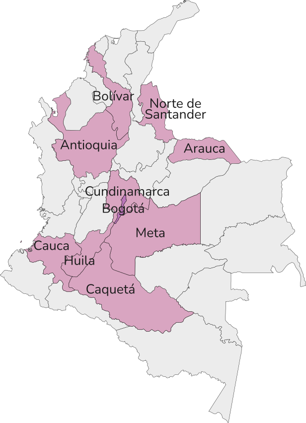

La **Asociación Red de Mujeres Víctimas y Profesionales** desarrolla sus actividades en nueve regiones del país:  
* (i) Antioquia, en la ciudad de Medellín, los municipios de Barbosa, en la subregión del Bajo Cauca y en los resguardos de Dabeiba y Chigorodó con indígenas Embera Katio y Embera Chamí;  
* (ii) Arauca, en la ciudad de Arauca;  
* (iii) Bolívar, en la ciudad de Cartagena y el municipio de María la Baja;  
* (iv) Cauca, en la ciudad de Popayán y en el resguardo Huellas con indígenas Nasa;  
* (v) Caquetá, en los municipios de Valparaíso, Curillo, Albania, Florencia y Morelia;  
* (vi) Huila, en la ciudad de Neiva y el municipio de Algeciras;  
* (vii) Meta, en los municipios de Guamal, Castillo, La Uribe, Puerto Rico y la ciudad de Villavicencio;  
* (viii) Norte de Santander, en la ciudad de Cúcuta, el municipio de Tibú y la subregión del Catatumbo;  
* (ix) Cundinamarca, en el municipio de Soacha. En Bogotá está el equipo nacional.  

Además, la Red es integrante y fundadora del Movimiento global de víctimas y sobrevivientes de violencia sexual, en el que participan representantes de 14 países de todos los continentes. Este movimiento global tiene el apoyo de la fundación del Dr. Denis Mukwege (premio nobel de paz 2018).

